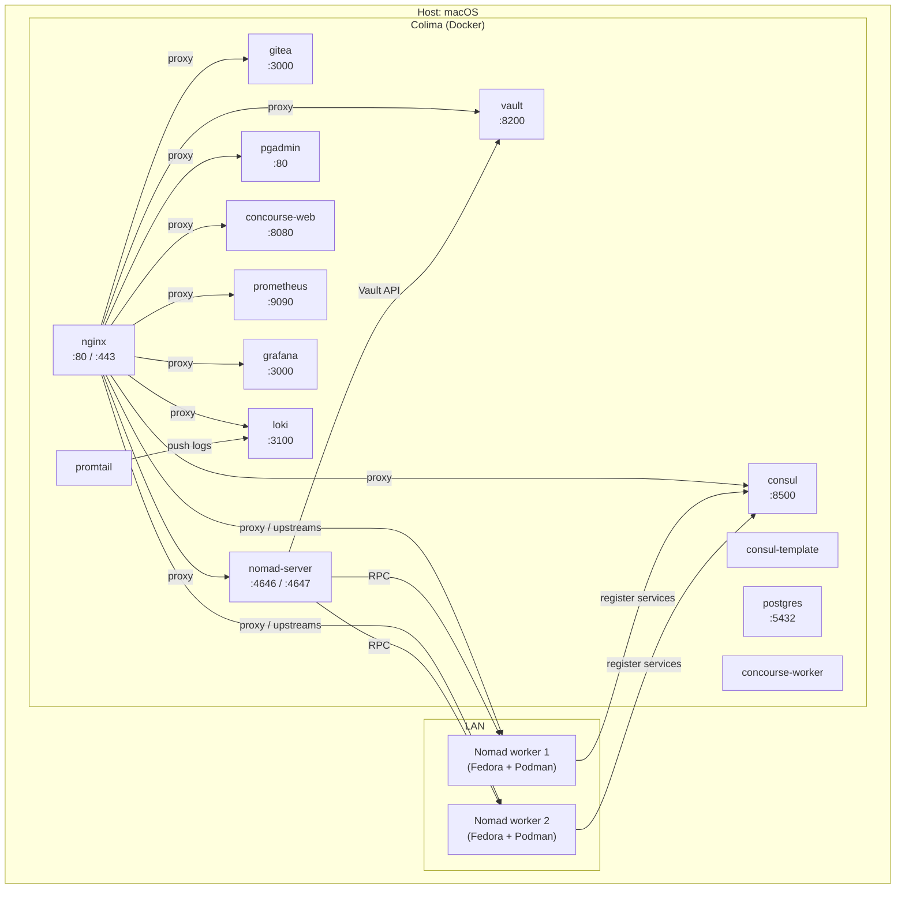
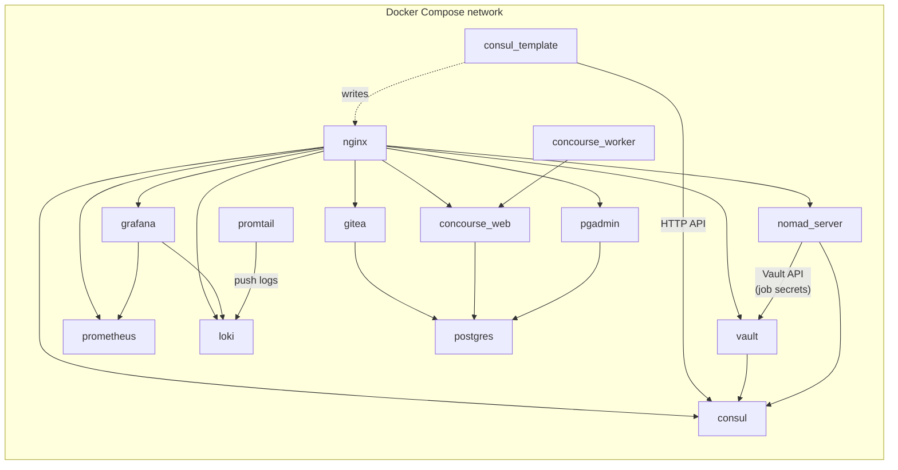
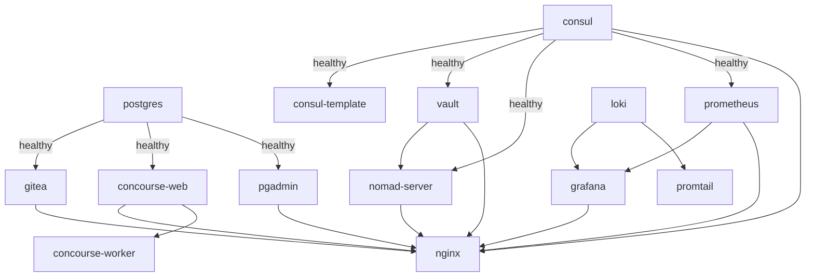
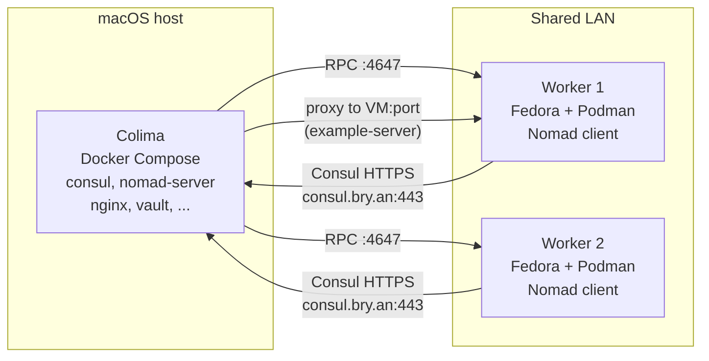
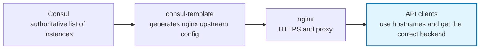
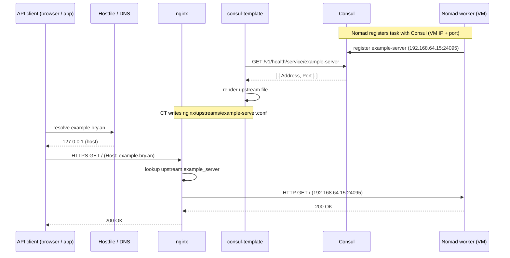
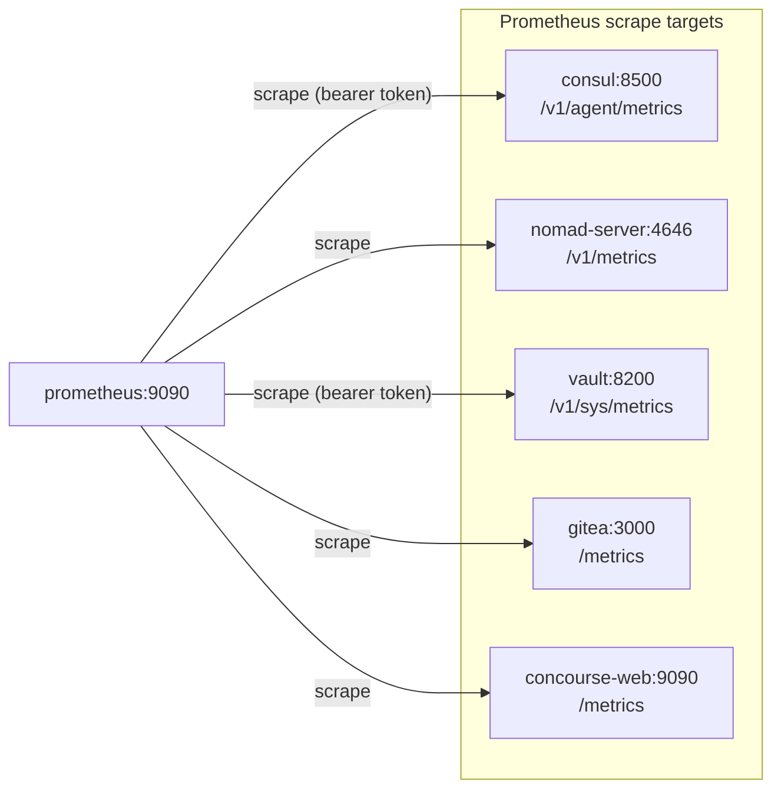
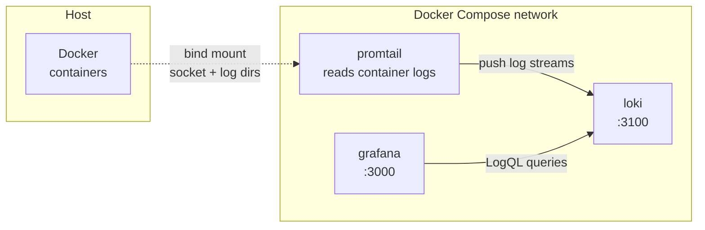

# Architecture

This document describes the mini-cloud topology: the host, the Docker composition, external Nomad workers, and how Consul-backed services are exposed to API clients (e.g. browsers and other apps).

---

## 1. Host and runtime
- **Host:** macOS.
- **Container runtime:** [Colima](https://colima.run), providing a Linux VM and Docker API compatibility on the Mac.
- **Networking:** The Colima VM uses shared networking (e.g. `192.168.5.x`) with the host. To allow containers to reach external Nomad workers on the LAN (e.g. `192.168.64.x`), routing is configured so traffic from containers to `192.168.64.0/24` goes via the Mac; the Mac forwards and has a route back to the Docker bridge. This keeps the stack off bridged LAN mode while still allowing the edge proxy (nginx) to reach worker IPs.

All services in the "Docker composition" section below run inside Colima on the host unless stated otherwise.

---

## 2. Docker composition

The stack is defined in `docker-compose.yml`. Services share a single Compose network and resolve each other by service name (e.g. `consul`, `nomad-server`).

### Service roles and communication

| Service | Role | Communicates with |
|--------|------|--------------------|
| **nginx** | TLS termination and reverse proxy. Serves all HTTPS hostnames (e.g. `git.bry.an`, `consul.bry.an`, `example.bry.an`, `metrics.bry.an`, `dash.bry.an`, `logs.bry.an`) and proxies to backends. | **Backends:** gitea, vault, concourse-web, pgadmin, consul, nomad-server, **prometheus**, **grafana**, **loki**; and **dynamic upstreams** (e.g. `example_server` from `nginx/upstreams/`, populated by consul-template). Does not start until gitea, vault, concourse-web, pgadmin, consul, nomad-server, prometheus, grafana are present. |
| **consul-template** | Renders config from Consul (e.g. nginx upstreams for Nomad-discovered services). | **Consul** (HTTP API at `consul:8500`) to query service catalog; writes into **nginx/upstreams/** (e.g. `example-server.conf`). Starts only after **consul** is healthy (leader elected). |
| **consul** | Service discovery and health. Single server, ACLs enabled; Vault can bootstrap and issue tokens. | **Vault** (Vault talks to Consul for ACL bootstrap/config). **Nomad server** and **consul-template** talk to Consul. External **Nomad clients** (workers) register with Consul over HTTPS (e.g. `consul.bry.an:443`). |
| **vault** | Secrets; Consul ACL token issuance and Nomad ACL token issuance (both configured during setup). | **Consul** (for ACL integration). **Nomad server** (Nomad connects to Vault so jobs can request secrets via `vault { policy = [...] }` or template stanzas; see § 2.1 below). No other containers depend on Vault for startup. |
| **nomad-server** | Nomad control plane: scheduling and API. | **Consul** (for service registration and discovery). **Vault** (for job-injected secrets: Nomad uses `NOMAD_VAULT_TOKEN` to create tokens for tasks that request Vault policies). **External Nomad clients** connect to the host's RPC (e.g. `192.168.64.1:4647`). |
| **postgres** | Shared SQL database. | **gitea**, **concourse-web**, **pgadmin** (each has its own DB/user). |
| **gitea** | Git and (optionally) package registry. | **postgres**. Exposed via nginx as `git.bry.an`. |
| **concourse-web** | Concourse CI API and UI. | **postgres**. Exposed via nginx as `ci.bry.an`. |
| **concourse-worker** | Runs Concourse jobs. | **concourse-web** (TSA). |
| **pgadmin** | DB UI. | **postgres**. Exposed via nginx (e.g. `pg.bry.an`). |
| **prometheus** | Metrics collection and querying. Scrapes Prometheus-format metrics from Consul, Nomad, Vault, Gitea, and Concourse. | **Consul** (for ACL token when scraping Consul metrics). Exposed via nginx as `metrics.bry.an`. Uses bearer tokens (from env) for Consul and Vault scrape targets. |
| **grafana** | Dashboard UI for metrics and logs. Uses Prometheus and Loki as data sources (pre-provisioned). | **Prometheus** (HTTP at `prometheus:9090`) for metrics. **Loki** (HTTP at `loki:3100`) for log queries. Exposed via nginx as `dash.bry.an`. |
| **loki** | Log aggregation; stores log streams from the stack. | **Grafana** (Loki data source for Explore and dashboards). **Promtail** sends logs here. Exposed via nginx as `logs.bry.an`. |
| **promtail** | Log collector; reads container logs from the host and ships them to Loki. | **Loki** (push log streams). Reads from host Docker socket and container log directories (bind-mounted). |

### Dependency flow (startup)

- **postgres** has a healthcheck; **gitea**, **concourse-web**, **pgadmin** depend on postgres (healthy).
- **consul** has a healthcheck (leader elected); **consul-template** and **vault** depend on consul; **nomad-server** depends on consul and vault.
- **loki** has no service dependencies. **promtail** depends on loki. **grafana** depends on prometheus and loki.
- **nginx** depends on gitea, vault, concourse-web, pgadmin, consul, nomad-server, prometheus, grafana (no health condition; best effort).

### 2.1 Nomad–Vault connection

The Nomad server is configured with a Vault block (`nomad/server.hcl.tpl`): it connects to Vault at `http://vault:8200` using the token supplied as `NOMAD_VAULT_TOKEN`. When a job requests secrets—e.g. a task with `vault { policy = ["my-policy"] }` or a `template` stanza that pulls from Vault—Nomad uses that token to create short-lived Vault tokens for the allocation. Jobs can then read secrets from Vault at runtime without embedding credentials in the job file. If `NOMAD_VAULT_TOKEN` is unset, Nomad still starts but jobs that request Vault integration will fail to receive tokens.

### Diagram: System topology

High-level view of host, Colima, Compose services, and external workers.

### Diagram: Docker service communication

Which Compose services talk to which (inside the Colima network).

### Diagram: Startup dependencies

Order and health conditions (postgres and consul healthy before their dependents).

---

## 3. External workers (UTM VMs, Nomad clients)

Nomad **clients** (workers) do not run in Docker; they run on separate machines so they can use real hardware and full container runtimes.

### Diagram: Host and workers

- **Platform:** UTM (or similar) VMs on a shared network with the Mac (e.g. `192.168.64.1` = Mac, `192.168.64.15` / `192.168.64.16` = VMs).
- **OS:** Fedora (or other Linux).
- **Container runtime:** Podman (Docker-compatible); Nomad uses the Docker task driver with `unix:///run/podman/podman.sock`.
- **Nomad:** Each VM runs `nomad agent -config=...` with a **client** config that points to the Nomad server on the host (e.g. `192.168.64.1:4647`) and to Consul (e.g. `consul.bry.an:443` with TLS). The client advertises its own HTTP/RPC addresses (e.g. `192.168.64.15:4646`) so Consul's "Nomad Client HTTP Check" can reach it.
- **Config:** See `nomad/client.hcl`. Key points: `bind_addr`, `advertise` (http/rpc), `client.servers`, `consul.address` + `consul.ssl` + `consul.token`, and the Docker plugin for Podman.

Workloads (e.g. the example nginx job) run as containers on these VMs. Nomad registers their **services** with Consul using the **host** address and port (`address_mode = "host"`) so that the edge proxy (nginx) on the Mac can reach them at VM IP + dynamic port.

---

## 4. Mapping Consul services for API clients

API clients (browsers, scripts, other services) reach the mini-cloud over HTTPS via the host. They use **hostnames** (e.g. `example.bry.an`, `consul.bry.an`); the hostfile (or DNS) resolves those to the host (e.g. `127.0.0.1` or the Mac's LAN IP). Nginx then routes by `Host` and proxies to the right backend.

### Static backends

For services that are **inside** the Compose stack, nginx uses fixed upstreams (server blocks with `proxy_pass` to a service name and port):

- `consul.bry.an` → `consul:8500`
- `nomad.bry.an` → `nomad-server:4646`
- `vault.bry.an` → vault (configured in `conf.d/`)
- `git.bry.an` → gitea
- `ci.bry.an` → concourse-web
- `pg.bry.an` → pgadmin
- `metrics.bry.an` → prometheus (Prometheus UI and API)
- `dash.bry.an` → grafana (Grafana dashboards)
- `logs.bry.an` → loki (Loki API for query and push)

No Consul lookup is involved for these.

### Consul-discovered backends (Nomad jobs)

For services that run **on Nomad workers** and are registered in Consul (e.g. `example-server`), the flow is:

1. **Consul** holds the catalog: service name, instance address (VM IP), port (host port), health.
2. **consul-template** runs in a container, talks to Consul's HTTP API (with an ACL token), and renders a file (e.g. `nginx/upstreams/example-server.conf`) that nginx includes. The template uses Consul's `service "example-server"` (or similar) to list healthy instances and output `server <address>:<port>;` lines.
3. **Nginx** includes `upstreams/*.conf` and reloads periodically (e.g. every 10s), so it picks up changes. A server block (e.g. `example.bry.an`) uses `proxy_pass http://example_server;`.
4. **API clients** call `https://example.bry.an`. The host resolves that to the Mac; nginx proxies to the upstream built from Consul (e.g. `192.168.64.15:24095`). With host routing on the Mac (and Colima routing as described in section 1), the nginx container can reach the worker VM and the app responds.

So "mapping Consul services for API clients" is:

### Diagram: Consul to API clients (discovered services)

Flow for a hostname backed by a Nomad service (e.g. `example.bry.an` → `example-server`).

### Adding a new Consul-backed hostname

1. Define the service in a Nomad job with `address_mode = "host"` so Consul gets VM IP + port.
2. Add a consul-template template that queries Consul (e.g. `service "my-service"`) and writes an upstream file under `nginx/upstreams/`.
3. Add an nginx server block (e.g. in `conf.d/`) for the hostname that `proxy_pass`es to that upstream.
4. Ensure the hostfile (or DNS) resolves the hostname to the host so clients hit nginx.

---

## 5. Monitoring and metrics (Prometheus)

Prometheus runs inside the Compose stack and collects metrics from the other services so you can monitor the mini-cloud from a single place.

### What Prometheus scrapes

- **Prometheus** — self-metrics (localhost:9090).
- **Consul** — `/v1/agent/metrics` (bearer token from `CONSUL_HTTP_TOKEN`).
- **Nomad** — `/v1/metrics` on the Nomad server.
- **Vault** — `/v1/sys/metrics` (bearer token from `METRICS_VAULT_TOKEN`; token must have read on `sys/metrics`).
- **Gitea** — `/metrics` (metrics enabled via `GITEA__metrics__ENABLED=true`).
- **Concourse web** — `/metrics` on the Concourse web service (port 9090).

### Diagram: Prometheus scraping endpoints

Prometheus (inside the Compose network) periodically scrapes each target; clients reach the Prometheus UI via nginx at `https://metrics.bry.an`.

Configuration lives in `prometheus/prometheus.yml`. The Prometheus UI and API are exposed over HTTPS at **https://metrics.bry.an** (nginx proxies to `prometheus:9090`). Use the UI to run PromQL queries, view targets, and inspect scrape status. **Grafana** at **https://dash.bry.an** uses this Prometheus as its default data source for dashboards (see service table above).

### Token requirements

- **Consul:** Set `CONSUL_HTTP_TOKEN` in the environment so Prometheus can scrape Consul’s metrics endpoint (same token used by consul-template and Nomad).
- **Vault:** Set `METRICS_VAULT_TOKEN` to a Vault token with read permission on `sys/metrics` so Prometheus can scrape Vault. Create a policy and token in Vault if ACLs restrict access.

---

## 6. Logging (Loki, Promtail, Grafana)

The stack collects container logs and makes them queryable in one place, similar to managed log services in the cloud (e.g. CloudWatch Logs, Datadog). **Loki** stores log streams; **Promtail** ships logs from the host into Loki; **Grafana** queries Loki so you can explore and correlate logs with metrics.

### Roles

- **Loki** — Log aggregation store. It receives log streams from Promtail (and can accept push from other clients), indexes them by labels (e.g. container name, job), and serves LogQL queries. No full-text index of log body; it uses labels for selection and scans matching streams, which keeps it cheap and simple. Exposed via nginx at **https://logs.bry.an** (Loki API: query and push endpoints).
- **Promtail** — Log collector that runs in the Compose network. It reads container logs from the host via bind-mounted Docker socket and container log directories (`/var/run/docker.sock`, `/var/lib/docker/containers`). It adds labels (e.g. container name, compose service) and pushes log streams to Loki. Configuration: `promtail/promtail-config.yml`.
- **Grafana** — Already used for metrics (Prometheus). The provisioning in `grafana/provisioning/datasources/` adds Loki as a data source. You use **Explore** (or panels with the Loki data source) to run LogQL queries, filter by container/service, and jump between logs and metrics for the same time range.

### Diagram: Log flow

Promtail runs inside the stack but reads log files from the host’s Docker data; it then pushes to Loki. Grafana (and external clients, if allowed) query Loki over HTTP. Nginx proxies `logs.bry.an` to `loki:3100` so the Loki API is available over HTTPS for tools that need to query or push from outside the Compose network.

### Configuration

- **Loki:** `loki/loki-config.yml` — storage path, retention, and server listen address. Data is stored in the `loki_data` volume.
- **Promtail:** `promtail/promtail-config.yml` — Loki push URL (`http://loki:3100/loki/api/v1/push`), pipeline stages (e.g. to parse or relabel), and which paths to scrape (Docker container logs).
- **Grafana:** Loki is provisioned as a data source in `grafana/provisioning/datasources/datasources.yml`. No extra setup needed to start querying logs in Explore.
